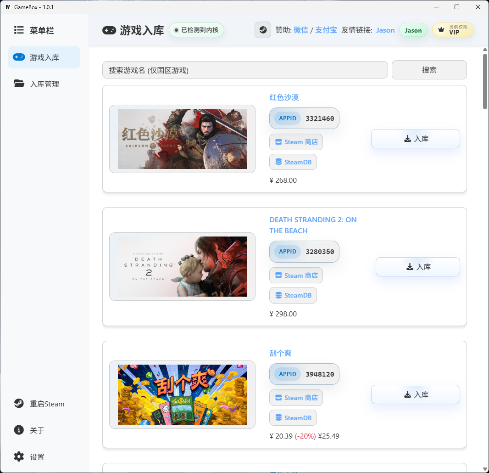
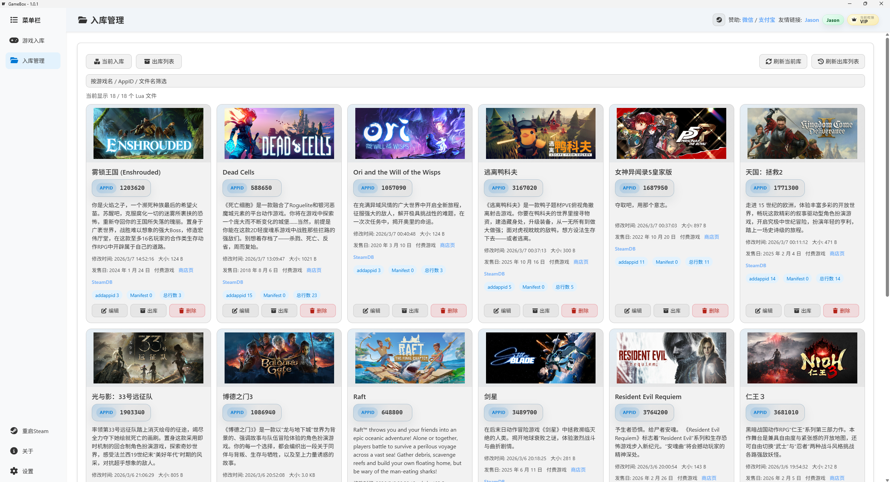
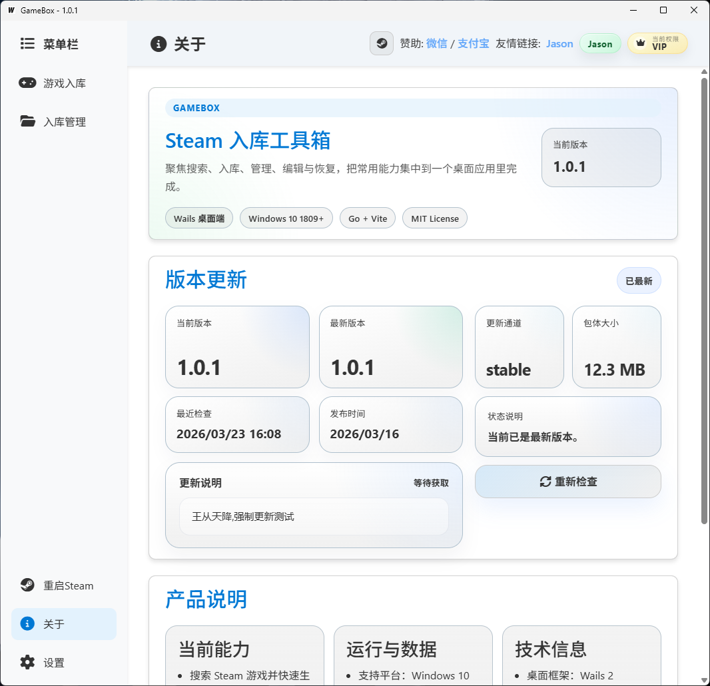
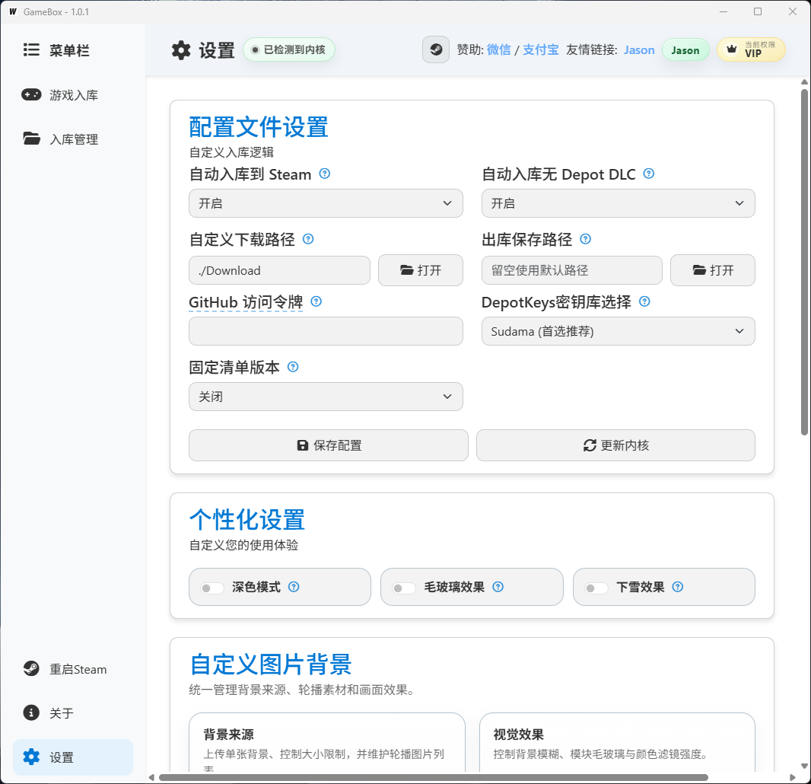

# GameBox Downloads

> GameBox 公开版本下载仓库。

## 项目简介

GameBox 是一个基于 `Go + Wails` 构建的 Windows 桌面应用，用于将 Steam 相关资源处理流程进行图形化与工程化封装。项目包含桌面客户端、鉴权与管理后台，以及版本发布和更新分发链路。

这是一个集桌面客户端、后台管理和自动更新能力于一体的完整软件项目。

本仓库主要用于承载公开版本资源，并作为项目简介入口。

## 核心功能

- Steam 游戏搜索与热门内容获取
- Steam 路径识别与本地目录处理
- DepotKey 与 Manifest 信息获取
- Lua 文件生成流程
- 本地配置管理与调试选项
- 用户登录与激活码功能
- 客户端更新检测、下载与安装
- 后台用户、角色、会话、兑换码与版本管理
- 支持 `stable` / `beta` 双更新通道

## 架构组成

- `桌面端`：`Go`、`Wails`、`React`、`Vite`、`TypeScript`
- `后台服务`：`Go`、`Gin`、`Gorm`、`SQLite`、`JWT`
- `发布链路`：更新清单、安装包校验、公开资源分发

## 技术栈

`Go` `Wails 2` `React 19` `Vite 7` `TypeScript 5` `Gin` `Gorm` `SQLite` `JWT` `Bootstrap 5` `Docker` `PowerShell`

## 项目截图

### 游戏入库

### 入库管理

### 关于与版本更新

### 设置页面

## 仓库用途

- 存放公开发布版本
- 提供安装包下载入口
- 展示 GameBox 项目简介

## 主项目

核心源码与详细实现见主仓库 `GameBox`。
